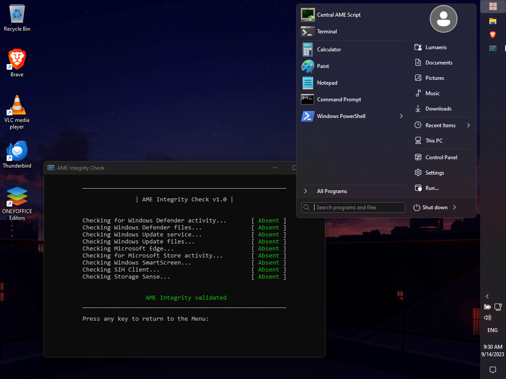

# winconfig [WIP]

My configuration of Windows 11. You may tell it is .dotfiles for Windows, but at the same time it is not. Based on [AME11](https://git.ameliorated.info/Styris/AME-11) work.

*This is what it should look like... but atm very different options apply.*

# Requirements

* A **fresh** install of Windows 11 2022 Update (22H2) `22621`. It doesn't matter which edition, but `Pro` is recommended. I strongly advise against installing `Pro N`.
* Stable internet connection.
* Presence of Windows activation.
* Perhaps a temporary blackout of paranoia of Microsoft, since we need to update the system completely along with applications from the Store. Use a VPN if you want to hide your IP address from them.
